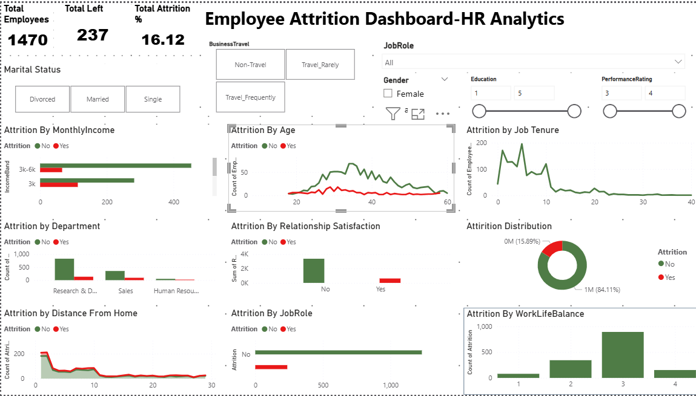

# EmployeeAtttritionAnalysis

## Project Overview
An end-to-end HR analytics project to analyze why employees leave the company using Python, SQL, and Power BI.

---

## Tools & Technologies Used
- Python (Pandas, Seaborn, Matplotlib)
- MySQL (SQL Queries)
- Power BI (Dashboard & KPIs)

---

## Business Questions Answered
- What’s the overall attrition rate?
- Which departments have the highest attrition?
- Does distance from home impact employee retention?
- Are low satisfaction or low income linked to resignations?
- How does age, tenure, or relationship satisfaction influence attrition?

---

## Dashboard Features
- KPIs: Attrition %, Active Employees
- Filters: Gender, Department, Job Role
- Charts: Area Charts, Income Bands, Satisfaction Levels

---

## Key Insights
- Most attrition occurs within 1–3 years
- Employees living 1–10 km from office showed higher attrition
- Low Relationship Satisfaction correlates strongly with exits
- R&D department shows the highest attrition

---

## 🙋 About Me
👤 **R. Nagarjuna**  
💼 Aspiring Data Analyst | Python, SQL, Power BI | Open to full-time roles and internships  
🔗 [LinkedIn](https://www.linkedin.com/in/R-Nagarjuna) | 📧 arjunravella108@gmail.com | 📞 7095740732
